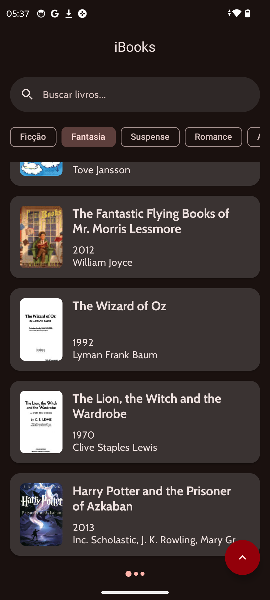
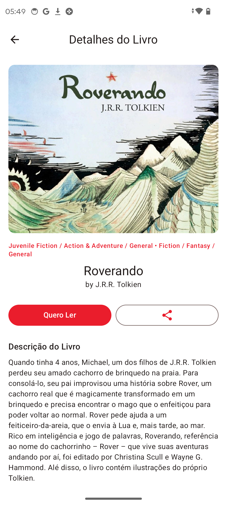

# iBooks

[](https://kotlinlang.org/)
[](https://developer.android.com/jetpack/compose)
[](LICENSE)

## Índice

* [Sobre](#sobre)
* [Funcionalidades](#funcionalidades)
* [Screenshots](#screenshots)
* [Requisitos](#requisitos)
* [Instalação](#instalacao)
* [Como Usar](#como-usar)
* [Arquitetura e Padrões](#arquitetura-e-padroes)
* [Stack de Tecnologias](#stack-de-tecnologias)
* [Estrutura de Pastas](#estrutura-de-pastas)
* [Testes](#testes)
* [Contribuição](#contribuicao)
* [Licença](#licenca)

---

## Sobre

O **iBooks** é um aplicativo Android desenvolvido em **Kotlin** usando **Jetpack Compose**, que permite buscar, navegar e visualizar detalhes de livros. A interface minimalista e a navegação fluida garantem uma experiência agradável tanto no modo light quanto dark.

---

## Funcionalidades

* 🔍 Pesquisa de livros por título, autor ou ISBN
* 📚 Listagem de resultados com imagens de capa e informações essenciais
* 📖 Tela de detalhe com descrição, avaliações e botão para abrir em loja
* ⚙️ Suporte a temas Light e Dark automáticos
* 🔄 Tratamento de erros e estado de carregamento (loading, empty, error)
* 🛠️ Injeção de dependências com Koin
* 📡 Comunicação com API REST (Retrofit + OkHttp + Gson)
* 🎨 Carregamento de imagens com Landscapist + Glide

---

## Screenshots

<div align="center">
  
  
  
  
  
</div>

---

## Requisitos

* Android Studio Giraffe (ou superior)
* SDK Android 33 (Android 13)
* JDK 11+
* Conexão com internet para acessar API de livros

---

## Instalação

1. Faça **fork** ou **clone** deste repositório:

   ```bash
   git clone https://github.com/seu-usuario/iBooks.git
   ```
2. Abra o projeto no Android Studio.
3. Aguarde o download dos plugins e dependências via Gradle.
4. Conecte um dispositivo físico ou configure um emulador com API 33+.

---

## Como Usar

1. Execute a aplicação no Android Studio (Shift+F10 ou ▶️).
2. Na tela inicial (Splash), aguarde o carregamento.
3. Use a barra de busca para digitar o nome do livro, autor ou ISBN.
4. Toque em um item da lista para ver detalhes.
5. Na tela de detalhe, explore descrição e avaliações.

---

## Arquitetura e Padrões

O projeto segue o padrão **MVVM** (Model-View-ViewModel) organizado em camadas:

* **data**

  * Models (DTOs, Entities)
  * Repositórios
  * Configuração do Retrofit / OkHttp
* **commons**

  * BaseViewModel
  * Tratamento de erros e eventos
* **presentation**

  * **ui**: componentes reutilizáveis (Botões, Listas, Dialogs)
  * **screens**: Composables de cada tela (Splash, Lista, Detalhe)
  * **navigation**: NavGraph e definição de rotas
  * ViewModels específicos (BookListViewModel, BookDetailViewModel)
* **di**

  * Módulos de injeção (Koin)
* **app**

  * MainActivity / MainApplication

---

## Stack de Tecnologias

* **Linguagem:** Kotlin
* **UI:** Jetpack Compose
* **Navegação:** Navigation Compose
* **DI:** Koin
* **HTTP:** Retrofit + OkHttp Logging
* **JSON:** Gson
* **Imagens:** Landscapist + Glide
* **Testes:** JUnit, Espresso (instrumented)

---

## Estrutura de Pastas

```
iBooks/
├── app/                    
│   ├── src/
│   │   ├── main/
│   │   │   ├── java/com/rafael/ibooks/
│   │   │   │   ├── activity/      # MainActivity, Application
│   │   │   │   ├── commons/       # BaseViewModel, eventos
│   │   │   │   ├── data/          # Models, repositórios, API
│   │   │   │   ├── di/            # Módulos Koin
│   │   │   │   └── presentation/  # UI, navegação, ViewModels
│   │   │   └── res/               # layouts Compose, resources
│   └── build.gradle.kts
├── build.gradle.kts
├── gradle/…
└── settings.gradle.kts
```

---

## Testes

* **Unitários:**

  * Localizados em `app/src/test/java/...
  * Execute com:

    ```bash
    ./gradlew test
    ```
* **Instrumented (UI):**

  * Em `app/src/androidTest/java/...
  * Execute com:

    ```bash
    ./gradlew connectedAndroidTest
    ```

---

## Contribuição

1. Faça um **fork** do projeto.
2. Crie uma branch para sua feature ou correção (`git checkout -b feature/nome-da-feature`).
3. Realize commits claros e descritivos (`git commit -m "Adiciona …"`).
4. Abra um **Pull Request** explicando as mudanças.

---

## Licença

Este projeto está licenciado sob a [MIT License](LICENSE).
