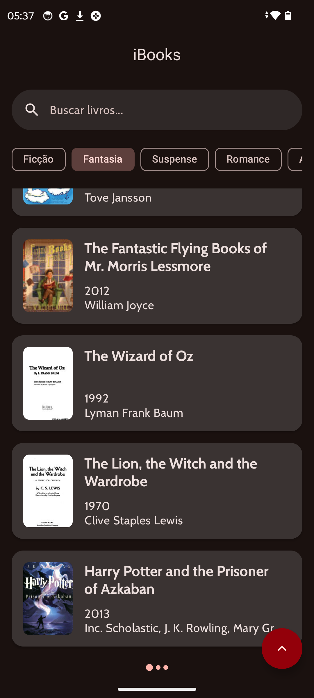
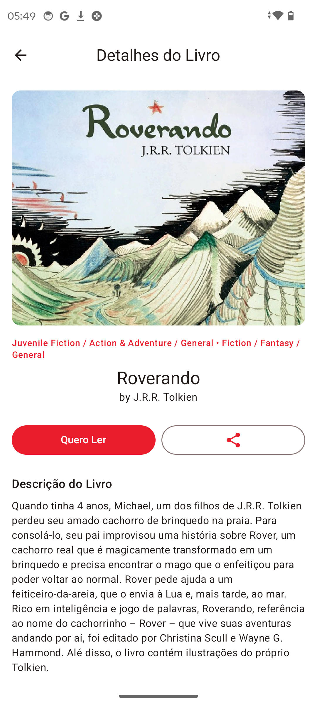

# iBooks

[](https://kotlinlang.org/)
[](https://developer.android.com/jetpack/compose)
[](LICENSE)

## Índice

* [Sobre](#sobre)
* [Funcionalidades](#funcionalidades)
* [Screenshots](#screenshots)
* [Requisitos](#requisitos)
* [Instalação](#instalacao)
* [Como Usar](#como-usar)
* [Arquitetura e Padrões](#arquitetura-e-padroes)
* [Stack de Tecnologias](#stack-de-tecnologias)
* [Estrutura de Pastas](#estrutura-de-pastas)
* [Testes](#testes)
* [Contribuição](#contribuicao)
* [Licença](#licenca)

---

## Sobre

O **iBooks** é um aplicativo Android desenvolvido em **Kotlin** e **Jetpack Compose** para descobrir, pesquisar e organizar livros. Além da busca pela Google Books API, o app oferece sugestões assistidas por IA, navegação por swipe e uma lista **Quero Ler** persistida offline.

---

## Funcionalidades

* 🔍 Pesquisa de livros por título, autor ou ISBN
* ✨ Sugestões de busca geradas com Gemini
* 📚 Listagem de resultados com imagens de capa e informações essenciais
* 📖 Tela de detalhe com descrição, avaliações e botão para abrir em loja
* 👉 Swipe para a direita para salvar um livro em **Quero Ler**
* 👈 Swipe para a esquerda para descartar um livro ou removê-lo de **Quero Ler**
* 💾 Persistência offline da lista **Quero Ler** com Room
* 🧭 Navegação inferior entre **Descobrir** e **Quero Ler**
* ⚙️ Suporte a temas Light e Dark automáticos
* 🔄 Tratamento de erros e estado de carregamento (loading, empty, error)
* 🛠️ Injeção de dependências com Koin
* 📡 Comunicação com API REST (Retrofit + OkHttp + Gson)
* 🎨 Carregamento de imagens com Landscapist + Glide

---

## Screenshots

<div align="center">
  
  
  
  
  
</div>

---

## Requisitos

* Android Studio compatível com AGP 8.11+
* SDK Android 36
* JDK 17+
* Conexão com internet para acessar API de livros

---

## Instalação

1. Faça **fork** ou **clone** deste repositório:

   ```bash
   git clone https://github.com/seu-usuario/iBooks.git
   ```
2. Abra o projeto no Android Studio.
3. Aguarde o download dos plugins e dependências via Gradle.
4. Opcionalmente, adicione as chaves em `local.properties`:

   ```properties
   GOOGLE_BOOKS_API_KEY=sua_chave_google_books
   GEMINI_API_KEY=sua_chave_gemini
   ```

   A chave do Google Books pode ficar vazia para consultas públicas, sujeitas às cotas da API. A chave Gemini é necessária para as sugestões com IA. Nunca versione o arquivo `local.properties`.
5. Conecte um dispositivo físico ou configure um emulador compatível.

---

## Como Usar

1. Execute a aplicação no Android Studio (Shift+F10 ou ▶️).
2. Na tela inicial (Splash), aguarde o carregamento.
3. Use a barra de busca ou uma sugestão para encontrar livros.
4. Na aba **Descobrir**, deslize para a direita para salvar em **Quero Ler** ou para a esquerda para descartar.
5. Na aba **Quero Ler**, deslize para a esquerda para remover um livro da lista.
6. Toque em um item para abrir seus detalhes.

---

## Arquitetura e Padrões

O projeto segue o padrão **MVVM** (Model-View-ViewModel) organizado em camadas:

* **data**

  * Models (DTOs e entidades Room)
  * Persistência local com DAO e banco Room
  * Repositórios
  * Configuração do Retrofit / OkHttp
* **commons**

  * BaseViewModel
  * Tratamento de erros e eventos
* **presentation**

  * **ui**: componentes reutilizáveis (Botões, Listas, Dialogs)
  * **screens**: Composables de cada tela (Splash, Lista, Detalhe)
  * **navigation**: NavGraph e definição de rotas
  * ViewModels específicos (BookListViewModel, BookDetailViewModel)
* **di**

  * Módulos de injeção (Koin)
* **app**

  * MainActivity / MainApplication

---

## Stack de Tecnologias

### 🧑‍💻 **Linguagem**
- Kotlin (com suporte a Coroutines e Flow)

### 🧱 **Arquitetura**
- MVVM + Clean Architecture
- Unidirectional Data Flow (UDF)

### 🎨 **UI**
- Jetpack Compose (com BOM)
- Material 3 (Material You)
- Compose Tooling & Preview
- Compose Icons (Extended)

### 🧭 **Navegação**
- Navigation Compose

### 💉 **Injeção de Dependência**
- Koin (Core, Android, Compose)

### 🌐 **Rede (HTTP)**
- Retrofit
- OkHttp Logging Interceptor

### 🔁 **Serialização**
- Gson (para JSON)

### 💾 **Persistência local**
- Room
- KSP

### 🖼️ **Imagens**
- Landscapist + Glide (otimizado para Compose)

### 🧪 **Testes**

**Unitários:**
- JUnit 4 & 5 (Jupiter)
- Kotlin Test
- MockK (incluindo agent)
- Truth (assertions Google)
- Turbine (para testar Flows)
- Coroutines Test
- Architecture Components Test (ViewModel etc.)

**Instrumentados (Android):**
- Espresso
- Compose UI Test (JUnit4)
- Compose Test Manifest

**Debug Tools:**
- Compose UI Tooling
- Compose Preview

---

## Estrutura de Pastas

```
iBooks/
├── app/                    
│   ├── src/
│   │   ├── main/
│   │   │   ├── java/com/rafael/ibooks/
│   │   │   │   ├── activity/      # MainActivity, Application
│   │   │   │   ├── commons/       # BaseViewModel, eventos
│   │   │   │   ├── data/          # API, banco Room, models e mappers
│   │   │   │   ├── domain/        # Repositórios e casos de uso
│   │   │   │   ├── di/            # Módulos Koin
│   │   │   │   └── presentation/  # UI, navegação, ViewModels
│   │   │   └── res/               # layouts Compose, resources
│   └── build.gradle.kts
├── build.gradle.kts
├── gradle/…
└── settings.gradle.kts
```

---

## Testes

* **Unitários:**

  * Localizados em `app/src/test/java/...
  * Execute com:

    ```bash
    ./gradlew test
    ```
* **Instrumented (UI):**

  * Em `app/src/androidTest/java/...
  * Execute com:

    ```bash
    ./gradlew connectedAndroidTest
    ```

---

## Contribuição

1. Faça um **fork** do projeto.
2. Crie uma branch para sua feature ou correção (`git checkout -b feature/nome-da-feature`).
3. Realize commits claros e descritivos (`git commit -m "Adiciona …"`).
4. Abra um **Pull Request** explicando as mudanças.

---

## Licença

Este projeto está licenciado sob a [MIT License](LICENSE).
